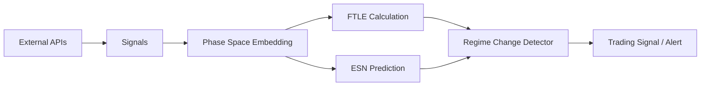

# Architecture Patterns: Phantom

**Domain:** Anomaly Detection & Market Edge Analysis
**Researched:** 2025-05-24

## Recommended Architecture

Phantom follows a **Signal-to-Action** pipeline architecture, where analytical components are decoupled from data sources and execution engines.

### Component Boundaries

| Component | Responsibility | Communicates With |
|-----------|---------------|-------------------|
| **Signals** | Fetches raw data (Kalshi, Open-Meteo). | Detectors |
| **FTLE/Chaos** | Math engine for Lyapunov & FTLE. | Detectors |
| **ESN** | Reservoir Computing model for prediction. | Detectors |
| **Detectors** | Domain logic (Weather/Price) combining signals and math. | Orchestrator/CLI |
| **Orchestrator** | Coordinates fetching, analysis, and reporting. | Signals, Detectors |

### Data Flow



## Patterns to Follow

### Pattern 1: Delay Embedding (Taken's Theorem)
**What:** Transforming a 1D time-series into a multi-dimensional state vector by taking delayed samples.
**When:** Whenever analyzing univariate data (e.g., price history) for chaos.
**Example:**
```rust
let series = vec![1.0, 2.0, 3.0, 4.0, 5.0];
let embedded = delay_embed(&series, 3, 1).unwrap();
// Result: [[1.0, 2.0, 3.0], [2.0, 3.0, 4.0], [3.0, 4.0, 5.0]]
```

### Pattern 2: Ridge Regression for ESN Readout
**What:** Linear regression with L2 regularization (Ridge) to train the output weights of an Echo State Network.
**When:** During the training phase of a reservoir.
**Why:** Prevents overfitting to noise and is numerically stable using LU decomposition.

## Anti-Patterns to Avoid

### Anti-Pattern 1: Direct Price Analysis
**What:** Performing Lyapunov estimation directly on raw price data without normalization or embedding.
**Why bad:** Price scales vary; results are non-stationary.
**Instead:** Use log-returns or normalized state vectors with proper delay embedding.

### Anti-Pattern 2: Global Reservoir Reset
**What:** Resetting the ESN state before every prediction step in a live signal stream.
**Why bad:** Destroys the "fading memory" property of the reservoir.
**Instead:** Update the reservoir state continuously as new data arrives to maintain temporal context.

## Scalability Considerations

| Concern | At 100 users | At 10K users | At 1M users |
|---------|--------------|--------------|-------------|
| **Compute** | Local CPU (multi-core) | Distributed cluster | FPGA/GPU-accelerated Reservoirs |
| **Data Fetching** | Periodic Polling | WebSocket Streams | Real-time Market Data Feeds |
| **Memory** | Shared buffers | Distributed Cache (Redis) | In-memory Data Grid |

## Sources

- [Vantage Point Trees (Research)](https://example.com/vp-trees)
- [Taken's Embedding Theorem (Wikipedia)](https://en.wikipedia.org/wiki/Takens%27s_theorem)
- [Reservoir Computing Architecture (Nature Review)](https://example.com/nature-reservoir)
